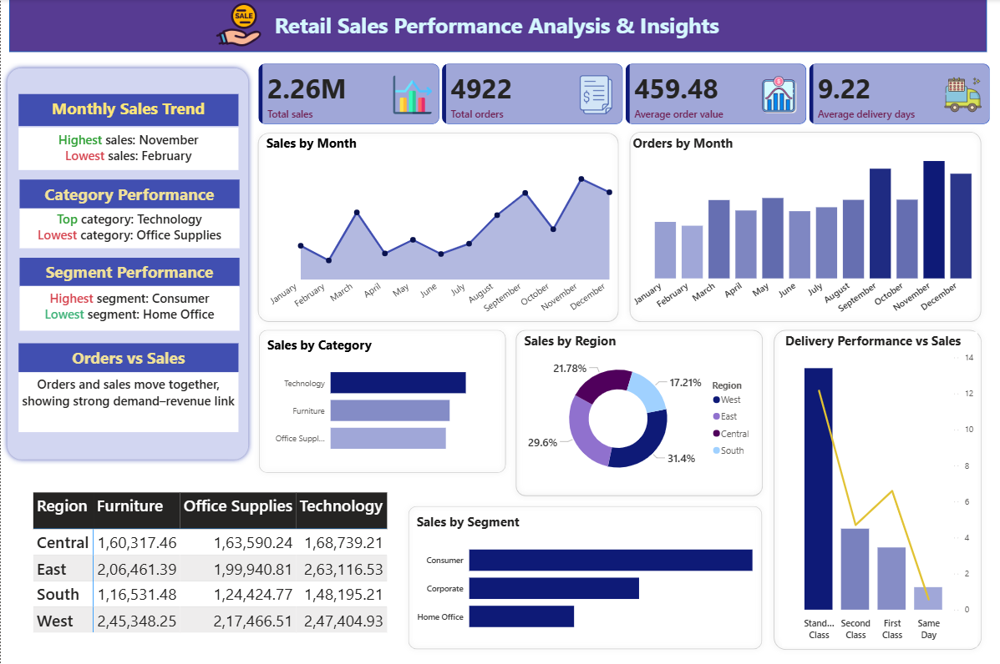

# Retail Sales Performance Analysis

1. Project Overview

This project analyzes retail sales data to understand how the business is performing.
The aim is to study sales trends, product categories, and regional sales using data analysis and dashboards.

2. Project Objective

The main goals of this project are:

To find total sales and orders

To see which product categories perform well

To analyze sales by region

To understand monthly sales trends

3. Tools Used

SQL – for data analysis

Excel – for data cleaning

Power BI – for dashboards and charts

DAX – for creating measures

4. Dataset Information

The dataset contains retail sales data with:

Order ID

Order Date

Product Category

Sales Amount

Quantity

Region

The data was cleaned in Excel before analysis.

5. Key Measures (Power BI)

The following measures were created using DAX:

Total Sales

Total Orders

Total Quantity

Average Order Value

Monthly Sales

Sales by Category

Sales by Region

Sample Measures
Total Sales = SUM(Sales[Total_Amount])

Total Orders = DISTINCTCOUNT(Sales[Order_ID])

Average Order Value =
DIVIDE([Total Sales], [Total Orders])

6. Analysis Steps

Cleaned the data using Excel

Used SQL to analyze sales and trends

Created measures in Power BI

Built dashboards to show results

7. Dashboard

The Power BI dashboard shows:

Total sales and orders

Monthly sales trend

Sales by category

Sales by region

(Add Power BI screenshots here)

8. Key Findings

Some product categories generate higher sales

Some regions have lower sales

Sales change month by month

Average order value shows customer buying pattern

9. Business Use

This analysis can help the business to:

Improve product planning

Focus on low-performing regions

Track sales performance easily

Make better decisions using data

10. Future Work

Add customer analysis

Include profit calculation

Add sales prediction
## 📷 Dashboard Preview

